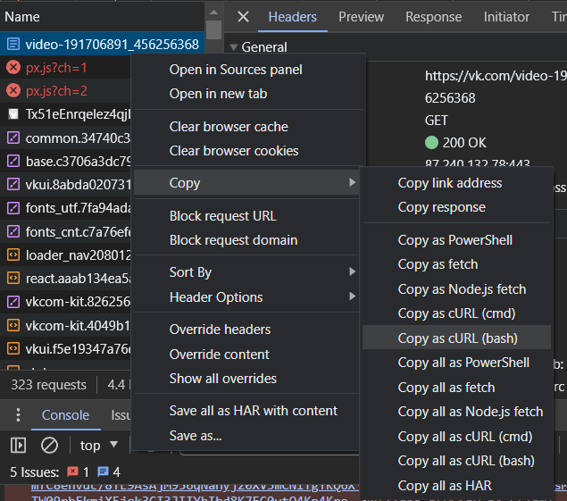
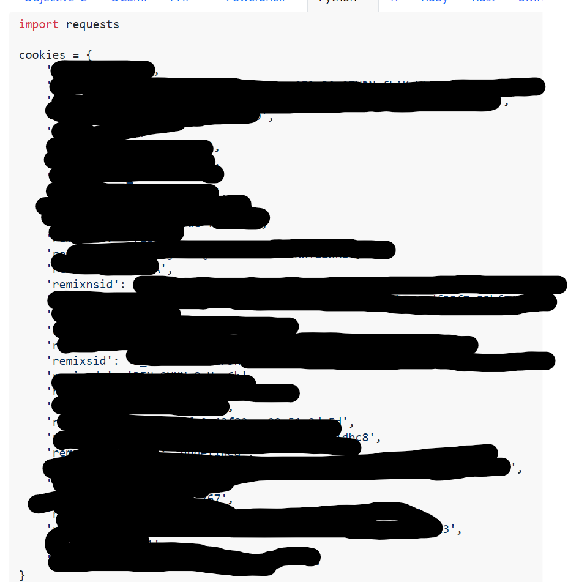

# Simple vkontakte downloader
## Usage
in console
```bash
git clone https://github.com/Hecker5556/vkdownloader && cd vkdownloader && pip install -r requirements.txt
```
```
usage: vkdownloader.py [-h] [-m M] link

positional arguments:
  link        link to vk post/линк до посту

options:
  -h, --help  show this help message and exit
  -m M        max size of video in mb/максимальный размер видео в мб
```
## Python usage
```python
import sys
if "path/to/vkdownloader.py" not in sys.path:
    sys.path.append("path/to/vkdownloader.py")
from vkdownloader import downloader
import asyncio
filenames = asyncio.run(downloader.download("url", maxsize=5))

# in async function
async def main():
    filenames = await downloader.download("url", maxsize=5)
```
## for private posts/для приватных сообщений
create an env.py file, and put/создайте файл env.py и поместите в него
```python
sid = "sid"
nsid = "nsid"
```
replacing sid and nsid with the cookies/Замените sid и nsid на cookie

**btw the cookies only work for ip that generated them/cookies работают только для ip, которые их сгенерировали**

## how to get those cookies/как получить cookies


go inspect element and select network and reload page/перейдите к осмотру элемента, выберите сеть и перезагрузите страницу



right-click first request and copy as bash/posix/щелкните правой кнопкой мыши первый запрос и скопируйте его как bash/posix

paste into/вставить в [https://curlconverter.com](https://curlconverter.com)



find the values and youre done/найдите значения, и все готово